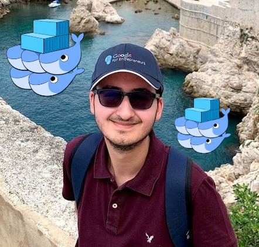

# :whale: DOCKER-PIRATE :whale:
Some of my Docker projects with multiple tools and technologies.  
This repository covers a general understanding of Docker DevOps practices from development to production.  

## DOCKER BASICS :anchor:
This repository covers the theory and basic concepts of Docker applications, good practices and some cool examples.  
If you want to explore more advanced Docker concepts, or have any question related to this repo, feel free to email me and I will be happy to 
answer you with my best try.  

  

* [Docker](https://www.docker.com)  
Docker is an amazing revolutionary tool. It is an open platform for developing, shipping, and running applications.  
Docker enables you to separate your applications from your infrastructure so you can deliver software quickly.  
The best place to learn Docker basics is the official [Docker Start-guide](https://docs.docker.com/get-started/), where you can find amazing videos 
and useful documentation for sample projects and best practices.  
To explore Docker in further detail, my advice is to start reading the sections of interest from the [Docker Documentation](https://docs.docker.com).  

The information of this repository is based on many online tutorials, so feel free to use it as a guide for your future projects!. 

## Dependencies :vertical_traffic_light:
The dependencies are explained in detail for each project, but the most important one is Docker (regardless your operating system).  
My advice is to primary understand the way Docker works with basic tutorials, and then try to develop amazing project ideas integrating Docker tools!.  

### Software dependencies (based on project)
* [Visual Studio Code](https://code.visualstudio.com/)  
Visual Studio Code is my main code editor for high-level programming. This is not absolutely necessary, but from my experience, it gives us a great performance and we can link it with Git and GitHub easily.  

* [Python](https://www.python.org/)  
Python is an amazing dynamic programming language that let us work fast, with easy and powerful integration of different software solutions.  

* [NodeJs](https://nodejs.org/en/)  
NodeJs is a JavaScript runtime built on Chrome's V8 JavaScript engine programming language. The community is amazing and lets us handle async functionalities in elegant ways.  

### Libraries and Package dependencies (based on project)

* [Flask](https://flask.palletsprojects.com/en/1.1.x/)  
Flask is an amazing minimalistic micro web framework written in Python. It lets us develop simple-medium level applications "one drop at a time".  

* [Express](https://expressjs.com)  
Express is a minimal and flexible Node.js web application framework that provides a robust set of features for web and mobile applications.  

* [MySQL](https://www.mysql.com)  
MySQL Database Service is a fully managed database service to deploy cloud-native applications. We will use it via the official [MySQL Docker Image](https://hub.docker.com/_/mysql). 

* [MongoDB](https://www.mongodb.com)  
MongoDB is a general purpose, document-based, distributed database built for modern application developers. We will use it via de official [MongoDB Docker Image](https://hub.docker.com/_/mongo).  

## Usage :dizzy:
All projects are really well commented and most of them have specifications and remarks for their purpose and I/O.  
I will be uploading most of the files, and try to keep it as clean as possible.  

## Special thanks :gift:
* Thanks to my friend Juan Felipe Becerra Ospina for introducing me to DevOps practices.  
* Thanks to all contributors of the great OpenSource projects that I am using.  

## Author :musical_keyboard:
### Santiago Garcia Arango.
  
